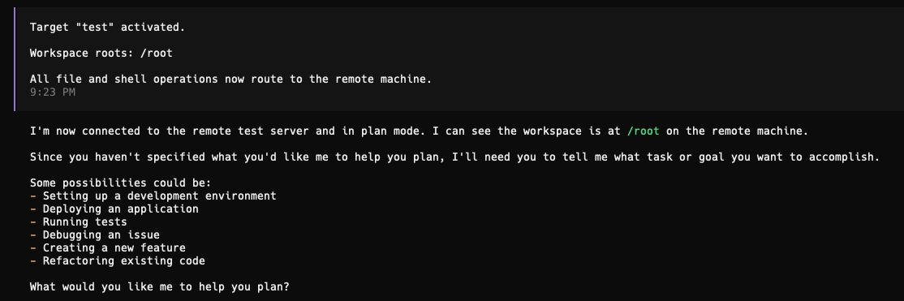

# opencode-rexd-target

`opencode-rexd-target` is an OpenCode plugin that makes selected remote machines feel like local development.

It routes tool calls to [REXD](https://github.com/samiralibabic/rexd), the Remote Execution Daemon, over SSH stdio (`ssh ... rexd --stdio`).



## What is REXD?

[REXD](https://github.com/samiralibabic/rexd) is a lightweight remote execution daemon that exposes process, filesystem, and PTY operations through a JSON-RPC API.

This plugin acts as the OpenCode client layer for REXD targets:

- On active target: tool calls are routed to remote `rexd`
- Without active target: file/shell tools run locally (normal OpenCode behavior)
- PTY tools are currently remote-only and require an active target

## Features

- `/target` command handling: `list`, `use`, `status`, `clear`
- Transparent tool routing to remote REXD when a target is active
- Local fallback when no target is active
- Core remote filesystem and shell support: `bash`, `read`, `write`, `list`, `glob`, `grep`
- Remote file parity with native REXD methods: `edit`, `apply_patch`
- PTY support via dedicated remote tools: `pty_spawn`, `pty_write`, `pty_read`, `pty_list`, `pty_kill`

## Requirements

- OpenCode with plugin support
- [REXD](https://github.com/samiralibabic/rexd) installed on target hosts and reachable over SSH
- Target registry at `~/.config/rexd/targets.json`
- REXD version with `fs.edit` and `fs.patch` support (v0.1.3+)

## Install

Latest release:

```bash
curl -fsSL https://raw.githubusercontent.com/samiralibabic/opencode-rexd-target/main/scripts/install.sh | bash
```

Pinned version:

```bash
curl -fsSL https://raw.githubusercontent.com/samiralibabic/opencode-rexd-target/main/scripts/install.sh | OPENCODE_REXD_TARGET_VERSION=v0.2.5 bash
```

The installer places files in your OpenCode config directory:

- `~/.config/opencode/plugins/rexd-target.js`
- `~/.config/opencode/commands/target.md`

## Post-install setup (required)

1. Ensure every target host runs [REXD](https://github.com/samiralibabic/rexd) `v0.1.3` or newer.
2. Create/update `~/.config/rexd/targets.json` on your local machine.
3. Restart OpenCode so the plugin is reloaded.
4. Run `/target list` and then `/target use <alias>`.

## Configure targets

Example `~/.config/rexd/targets.json`:

```json
{
  "version": 1,
  "targets": {
    "prod": {
      "transport": "ssh",
      "host": "example.com",
      "user": "deploy",
      "workspaceRoots": ["/srv/app"],
      "defaultCwd": "/srv/app"
    }
  }
}
```

## Usage

In OpenCode:

- `/target list`
- `/target use <alias>`
- `/target status`
- `/target clear`

Active target state is persisted per project at `.opencode/rexd-state.json`.

## Updating (existing users)

Update in this order:

1. Update `rexd` on remote target hosts.
2. Update this plugin locally.
3. Restart OpenCode.
4. Reconnect with `/target clear` and `/target use <alias>`.

Update commands:

```bash
# 1) remote hosts
curl -fsSL https://raw.githubusercontent.com/samiralibabic/rexd/main/scripts/install.sh | REXD_VERSION=v0.1.3 bash

# 2) local plugin
curl -fsSL https://raw.githubusercontent.com/samiralibabic/opencode-rexd-target/main/scripts/install.sh | OPENCODE_REXD_TARGET_VERSION=v0.2.5 bash
```

If you update the plugin before `rexd`, remote `edit`/`apply_patch` calls can fail with method-not-found errors on older servers.

Note: this plugin now preserves OpenCode UI metadata for `edit` and `apply_patch` so TUI diff rendering works the same way as native tools.

## Development

```bash
make typecheck
make build
```

## Open-source docs

- License: `LICENSE`
- Contributing: `CONTRIBUTING.md`
- Code of conduct: `CODE_OF_CONDUCT.md`
- Security policy: `SECURITY.md`
